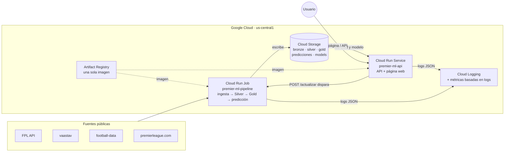

# Predicción de la fecha de la Premier League

Trabajo Final Integrador de **Implementación de Aplicaciones de Aprendizaje Automático en la
Nube** (Maestría en Management & Analytics, ITBA, 2026).

**Equipo:** Ignacio Sagulo · Iztok Bajda · Joaquín Vassarotto
**Docente:** Ramiro Savoie

Un sistema de MLOps de punta a punta que, antes de cada fecha de la Premier League, publica
la probabilidad de victoria local, empate y victoria visitante de cada partido, la registra
con la versión de modelo que la produjo y la mide contra el resultado real cuando se juega.
Corre en Google Cloud: un pipeline batch en Cloud Run Jobs, una API y una página web en Cloud
Run, y un bucket de Cloud Storage como único estado.

---

## Resumen

| | |
|---|---|
| **Problema** | Cada fecha hay diez partidos y ninguna lectura anticipada que sea trazable y se mida después |
| **Solución** | Tres probabilidades por partido, publicadas antes del deadline y evaluadas contra el resultado real |
| **Tarea de ML** | Clasificación multiclase 1X2 (local / empate / visitante), un partido por fila |
| **Modelo** | XGBoost, 279 features, promedio de 5 semillas |
| **Resultado offline** | 0,495 de accuracy en la temporada 2025-26 completa, contra 0,426 de "siempre gana el local"; iguala a las casas de apuestas en aciertos |
| **Resultado en producción** | 0,450 en las primeras cuatro fechas de 2026-27, contra 0,325 de "siempre gana el local" |
| **Infraestructura** | Cloud Run (Service + Job), Cloud Storage, Artifact Registry, Cloud Build, Cloud Logging y Monitoring |
| **Latencia** | p50 de 24 ms dentro del servicio, 82 ms medidos desde el cliente |
| **Costo** | Cercano a cero: el servicio escala a cero entre fechas y el Job se paga por ejecución |
| **Calidad** | 729 tests automatizados, incluido un control anti-leakage temporal |

---

## 1. Problema, usuario y propuesta de valor

**El usuario** es quien sigue la fecha y necesita una lectura anticipada de cada partido:
el hincha, el analista, el apostador informado. Hoy esa lectura se hace con intuición y
titulares, no es reproducible y nadie la mide después.

**La propuesta de valor** es un servicio que publica, antes del deadline de cada fecha, las
tres probabilidades de cada partido, junto con la versión del modelo que las produjo, y que
después las contrasta con el resultado real. El modelo no decide por el usuario: le da una
lectura probabilística y su nivel de confianza, y la persona decide qué hacer con ella.

**Por qué este dominio.** La etiqueta llega sola, un par de horas después de predecir: el
resultado del partido *es* la etiqueta. No hay etiquetado manual ni meses de espera, y eso
permite montar y operar el ciclo completo —predecir, registrar, medir, corregir— con datos
reales de la temporada en curso.

**Costo del error.** Un error es barato (no hay diagnóstico médico ni crédito otorgado). Eso
permite salir a producción con un modelo que acierta la mitad de las veces, siempre que la
lectura sea honesta, y lleva el *human-in-the-loop* a la salida, no al etiquetado.

---

## 2. ML Canvas

| Bloque | Definición en este caso |
|---|---|
| **1. Propuesta de valor** | Para quien sigue la fecha, un servicio que publica antes del deadline las tres probabilidades de cada partido, trazables y medidas contra el resultado |
| **2. Fuentes de datos** | Cuatro fuentes públicas, sin credenciales ni datos personales: football-data.co.uk, el archivo histórico de Fantasy Premier League (vaastav), la API oficial de FPL y la API de premierleague.com |
| **3. Tarea de predicción** | Clasificación supervisada multiclase 1X2. Una fila = un partido. XGBoost |
| **4. Ingeniería de features** | 279 features: forma reciente por línea del equipo, goles esperados (xG), rating Elo, historial de enfrentamientos, congestión de calendario y estadísticas de Opta. Todas calculadas con información anterior al inicio de la fecha |
| **5. Evaluación offline** | Split temporal: entrenamiento 2022-23 a 2024-25, evaluación sobre 2025-26 completa. Accuracy, log-loss y RPS contra baselines explícitos |
| **6. Toma de decisiones** | Pasar de tres probabilidades a una clase es una decisión separada del modelo, con reglas candidatas evaluadas en paralelo |
| **7. Realizando predicciones** | Batch antes del deadline (Cloud Run Job) más un servicio online (`GET /predict/{temporada}/{fecha}`) |
| **8. Recolectando datos** | Después de cada fecha se ingestan los resultados oficiales y se cruzan contra las predicciones registradas. La capa cruda es de solo agregado, con cada snapshot fechado |
| **9. Construyendo modelos** | Reentrenamiento manual al cambiar de temporada o si cae la performance. Un modelo nuevo se promueve solo si le gana al de producción con evidencia estadística |
| **10. Monitoreo en vivo** | Cada fecha jugada se mide contra el resultado real y contra los baselines sobre los mismos partidos |

---

## 3. Datos

| Fuente | Qué aporta | Acceso |
|---|---|---|
| **football-data.co.uk** | Resultados y cuotas de las casas de apuestas (usadas solo como referencia de comparación, nunca como feature) | Público, CSV |
| **vaastav / Fantasy-Premier-League** | Histórico jugador por fecha desde 2016-17 | Público, GitHub |
| **API oficial de Fantasy Premier League** | Calendario, deadlines y resultados de la temporada en curso | Pública, sin clave |
| **API de premierleague.com** | Copas, competencias europeas y ~180 estadísticas de Opta por equipo y partido | Pública, sin clave |

- **Ventana:** desde 2022-23, la primera temporada con goles esperados disponibles. Son
  más de 1.500 partidos con resultado, más la temporada 2026-27 en curso.
- **Permisos y privacidad:** todas las fuentes son públicas. No hay datos personales: las
  entidades son equipos y futbolistas profesionales con estadísticas publicadas, y el
  modelo trabaja a nivel equipo-partido. Los logs no guardan datos de quien consulta.
- **Supuestos principales:** el deadline de cada fecha es 90 minutos antes del primer
  partido; los resultados oficiales son la verdad de referencia; la clave estable de un
  equipo entre temporadas es su código corto (ARS, MUN…), no el id de la API.

El detalle de cada fuente y de sus trampas conocidas está en la
[guía técnica](docs/GUIA-TECNICA.md#fuentes-de-datos).

---

## 4. Arquitectura



**Flujo de datos (arquitectura medallón).** *Bronze* guarda lo que devuelve cada fuente,
sin modificar y con fecha de ingesta. *Silver* lo normaliza y unifica. *Gold* tiene una
fila por partido con sus 279 features, calculadas exclusivamente con información anterior
a la fecha. Ninguna capa se sobrescribe: cada versión anterior queda archivada y se puede
restaurar.

**Decisiones de diseño:**

1. **Una sola imagen para el servicio y el pipeline.** Comparten todo el código y solo
   cambia el comando de arranque. Así el código que calcula las features para entrenar es
   exactamente el mismo que el que se usa al predecir.
2. **El dato y el modelo no van dentro de la imagen.** Se leen del bucket. El código, el
   dato y el modelo cambian a ritmos distintos (con cada mejora, cada fecha, cada
   reentrenamiento) y cada uno se actualiza sin reconstruir los otros.
3. **El servicio no calcula features, las busca.** El pipeline deja Gold armado y la API
   hace una búsqueda. Por eso responde en milisegundos en vez de ~25 segundos.
4. **El pedido no ejecuta el pipeline.** La API solo le pide a Cloud Run que corra el Job
   y responde al instante; el pipeline tarda minutos y corre con su propio timeout,
   recursos y registro de ejecuciones. El Service y el Job usan la cuenta de servicio por
   defecto del proyecto.
5. **BigQuery descartado.** Gold pesa 1,5 MB; un archivo parquet en el bucket se lee en
   milisegundos y evita un servicio más para configurar y pagar.

---

## 5. Modelo y evaluación

**Evaluación offline** — temporada 2025-26 completa (380 partidos), nunca vista en el
entrenamiento:

| | Accuracy | Log-loss ↓ | RPS ↓ |
|---|---|---|---|
| Siempre gana el local | 0,426 | — | — |
| Prior de clase (frecuencias históricas) | 0,426 | 1,085 | — |
| **Modelo (XGBoost)** | **0,495** | **1,030** | **0,208** |
| Cuotas de cierre de las casas de apuestas | 0,495 | 1,012 | — |

**En producción** — primeras cuatro fechas de 2026-27 (40 partidos), predichas antes de
jugarse y registradas:

| | Accuracy | Log-loss ↓ | RPS ↓ |
|---|---|---|---|
| Baseline | 0,325 (siempre local) | 1,145 (prior) | 0,229 (prior) |
| **Modelo** | **0,450** | **1,046** | **0,200** |

**Lectura:**

- El modelo supera a los baselines triviales por unos 7 puntos de accuracy y **iguala a las
  casas de apuestas en aciertos**, aunque con probabilidades algo peor calibradas.
- **La confianza informa:** cuando el modelo asigna 60 % o más a un resultado, acierta 6 de
  cada 10; cuando no supera el 40 %, 2 de cada 9.
- **El punto débil es el empate.** Casi nunca es el resultado más probable, y el modelo casi
  no lo anuncia. Por eso el servicio publica las tres probabilidades y no solo la clase.
- **Con 40 partidos el margen de error es de ±8 puntos**: las fechas en vivo confirman el
  funcionamiento del ciclo, no permiten conclusiones fuertes sobre el modelo.
- Se compararon ocho tipos de modelo (entre ellos Random Forest, regresión logística,
  modelos de goles de Poisson y una red neuronal) y cinco mejoras de features con un criterio de
  aceptación fijado de antemano; ninguna mejora superó al modelo actual. La restricción
  principal es el volumen de datos (≈1.100 partidos de entrenamiento). El detalle está en
  [`training/README.md`](training/README.md).

Hay dos modelos con roles distintos: el de **evaluación**, entrenado sin 2025-26, es el que
produce las métricas de arriba; el de **producción** se reentrenó incluyendo 2025-26 y es el
que sirve la API. Sus métricas sobre esa temporada no son de generalización, y su
`metadata.json` lo declara.

---

## 6. La PoC desplegada en GCP

| Componente | Recurso | Función |
|---|---|---|
| Servicio | Cloud Run `premier-ml-api` | API FastAPI y página web; escala a cero |
| Pipeline | Cloud Run Job `premier-ml-pipeline` | Ingesta, transformación, features, predicción y registro |
| Almacenamiento | Cloud Storage | Todas las capas de datos, predicciones registradas y modelos versionados |
| Imagen | Artifact Registry `mlops-2026`, construida con Cloud Build | Solo código; sin datos ni modelos |
| Observabilidad | Cloud Logging y Cloud Monitoring | Logs JSON consultables por campo y dos métricas basadas en logs |

### Contrato de la API

| Endpoint | Función |
|---|---|
| `GET /` | Página web con el calendario y las predicciones |
| `GET /health` | Estado del servicio, modelo cargado y próxima fecha predecible. Responde `ok` o `degraded` con el motivo, nunca un error |
| `GET /predict/{temporada}/{fecha}` | Probabilidades de cada partido. Una fecha jugada devuelve la predicción registrada antes del partido y el resultado real; la próxima se predice en el momento; una fecha todavía no preparada responde 409 |
| `GET /calendario/{temporada}` | Las 38 fechas y el estado de cada una |
| `GET /actualizar` | Indica si hay resultados nuevos para incorporar |
| `POST /actualizar` | Dispara el Job del pipeline (requiere token de administrador) y responde 202 |
| `GET /actualizar/{id}` | Estado de esa ejecución |
| `GET /docs` | Documentación interactiva del contrato (OpenAPI) |

Cada respuesta incluye la versión del modelo, la versión del conjunto de features y la hora
de la predicción.

### El ciclo, de punta a punta

1. Termina una fecha. Desde la página, **"Actualizar datos"** llama a `POST /actualizar`.
2. El servicio le pide a Cloud Run que ejecute el Job y responde de inmediato.
3. El Job ingesta los resultados, reconstruye Silver y Gold, verifica que no haya leakage,
   predice la fecha siguiente y la registra en el bucket.
4. El servicio relee Gold: la fecha jugada muestra su resultado y la siguiente aparece
   predicha.

---

## 7. Operación

**Logs.** Una línea JSON por evento (`prediccion`, `prediccion_error`, `pipeline_disparo`,
…) con latencia, versión de modelo y cantidad de partidos. Nunca se registran features ni
datos de quien consulta, y un test lo verifica.

**Métrica principal: latencia.** Medida el 28/09/2026 sobre 20 requests, desde tres puntos:

| Punto de medición | p50 |
|---|---|
| Cliente | 82 ms |
| Borde de Cloud Run | 32 ms |
| Aplicación | 24 ms |

Se complementa con dos métricas basadas en logs en Cloud Monitoring (latencia y errores de
predicción) y con el tablero nativo de Cloud Run.

**Monitoreo del modelo.** `python -m monitoring.temporada_actual` mide cada fecha jugada
contra el resultado real y contra los baselines sobre los mismos partidos, y deja la tabla
fecha por fecha en `monitoring/output/` (fuera de git: se regenera desde las predicciones
registradas).

**Rollback.** Cada despliegue es una revisión inmutable de Cloud Run que fija su modelo y su
temporada. Volver atrás es mover el tráfico a la revisión anterior, en segundos y sin
reconstruir nada (`scripts/rollback.sh --anterior`). Los datos tienen su propio mecanismo
(`python -m common.versiones --restaurar`). Probado: con un modelo inexistente el servicio
pasa a `degraded`, las fechas ya jugadas siguen respondiendo, y el rollback lo restablece.

**Costos.** El servicio escala a cero y se paga por request; el Job, por ejecución; el
bucket, por almacenamiento (del orden de 200 MB). No se usan endpoints de Vertex AI,
que facturan por hora aunque no se usen.

**Riesgos y fallbacks.**

| Riesgo | Mitigación |
|---|---|
| Una fuente externa cae | El Job corta antes de escribir Gold; el servicio sigue con la última versión buena |
| Un despliegue roto | Rollback de revisión en segundos |
| Un dato corrupto | Restauración de la versión anterior de Gold |
| Leakage temporal | Control automático en el pipeline y en los tests; el pipeline se niega a registrar una predicción después de que empezó el partido |
| Modelo no disponible | `/health` informa `degraded`; las fechas jugadas se siguen sirviendo desde el registro |

---

## 8. Orquestación y ciclo de vida del modelo

- **Pipeline:** `python -m pipeline.pre_deadline` encadena las cuatro ingestas, las
  transformaciones, la construcción de Gold, el control anti-leakage y la predicción
  registrada. Si un paso falla, corta. Cada ejecución deja un registro con el estado y la
  duración de cada paso.
- **Disparador:** manual, desde la página (botón) o por API.
- **Promoción de modelos:** reentrenar es barato, promover exige evidencia. Un modelo
  candidato reemplaza al de producción solo si le gana en una comparación pareada (test de
  McNemar) sobre las mismas fechas y no empeora en la evaluación offline
  ([`training/promotion.py`](training/promotion.py)). Cada promoción queda registrada con su
  motivo, y los intentos rechazados también.
- **Reproducibilidad:** cada modelo guarda el commit de git, las versiones de librerías, los
  hiperparámetros y la versión del conjunto de features.

---

## 9. Limitaciones

- **No le gana al mercado.** Cuando el modelo discrepa de las casas de apuestas, acierta
  0,346 contra 0,365 de ellas. No tiene ventaja informativa.
- **Apostar con el modelo no es rentable.** El ROI simulado es negativo (−5,5 % en la
  evaluación offline).
- **El empate** (alrededor del 30 % de los partidos) casi nunca se anuncia.
- **Disparo programado pendiente.** El Job está listo para Cloud Scheduler, pero el deadline
  de cada fecha se mueve según la televisación; un cron semanal fijo quedaría desfasado.
- **El reentrenamiento se ejecuta a mano**, siguiendo la regla de promoción.

---

## 10. Correspondencia con la consigna

| Criterio | Dónde está |
|---|---|
| ML Canvas completo y coherente | [§2](#2-ml-canvas) |
| Problema, usuario y propuesta de valor | [§1](#1-problema-usuario-y-propuesta-de-valor) |
| PoC desplegada en GCP | [§4](#4-arquitectura), [§6](#6-la-poc-desplegada-en-gcp) · [`gcp/`](gcp/README.md) · [`Dockerfile`](Dockerfile) |
| Evaluación y métricas del caso | [§5](#5-modelo-y-evaluación) · [`training/README.md`](training/README.md) · [`monitoring/`](monitoring/README.md) |
| Evidencia de operación (logs, métricas, costos, riesgos) | [§7](#7-operación) · [`gcp/OBSERVABILIDAD.md`](gcp/OBSERVABILIDAD.md) · [`gcp/ROLLBACK.md`](gcp/ROLLBACK.md) |
| Diagrama de arquitectura | [§4](#4-arquitectura) · [`gcp/ARQUITECTURA-DEPLOY.md`](gcp/ARQUITECTURA-DEPLOY.md) |
| Datos sin información personal | [§3](#3-datos) |
| Secretos fuera del repositorio | El token de administrador es una variable de entorno del servicio; `.gitignore` y `.gcloudignore` excluyen credenciales |

---

## Estructura del repositorio

```
ingestion/    descarga de las cuatro fuentes a Bronze (solo agregado)
transform/    normalización y unificación en Silver
features/     construcción de Gold: 279 features por partido
training/     entrenamiento, evaluación, registro y promoción de modelos
serving/      API FastAPI, predicción y registro de predicciones
pipeline/     la cadena completa en un comando (lo que ejecuta el Job)
monitoring/   métricas de la temporada en curso contra el resultado real
common/       configuración, almacenamiento local/GCS, logging y versionado de datos
web/          la página que sirve la API
scripts/      despliegue, rollback, carga y lectura de logs
gcp/          guías de despliegue, observabilidad y rollback en GCP
notebooks/    recorrido completo del proyecto y laboratorio en Cloud Shell
tests/        729 tests, incluido el control anti-leakage
docs/         guía técnica, diccionario de features y material de la presentación
models/       metadatos y métricas de cada versión (los binarios viven en el bucket)
```

## Cómo empezar

```powershell
git clone https://github.com/bajdanico-cpu/tp-implementacion-nube.git
cd tp-implementacion-nube
.\scripts\setup_env.ps1          # entorno (Python 3.14); en Linux/macOS: bash scripts/setup_env.sh
python -m pipeline.pre_deadline  # datos → features → predicción de la próxima fecha
pytest                           # tests
```

No hace falta ninguna credencial para correrlo en local. Para desplegarlo en GCP:
[`gcp/README.md`](gcp/README.md).

## Documentación

| Documento | Contenido |
|---|---|
| [`docs/GUIA-TECNICA.md`](docs/GUIA-TECNICA.md) | Instalación, todos los comandos, fuentes de datos, control de leakage, baselines |
| [`docs/FEATURES.md`](docs/FEATURES.md) | Diccionario de las 279 features, generado desde el código |
| [`gcp/README.md`](gcp/README.md) | Punto de entrada para el despliegue en GCP |
| [`gcp/ARQUITECTURA-DEPLOY.md`](gcp/ARQUITECTURA-DEPLOY.md) | Componentes del despliegue, uno por uno |
| [`gcp/OBSERVABILIDAD.md`](gcp/OBSERVABILIDAD.md) · [`gcp/ROLLBACK.md`](gcp/ROLLBACK.md) | Operación: logs, métricas y vuelta atrás |
| [`training/README.md`](training/README.md) | Modelos comparados, experimentos y resultados |
| [`notebooks/00_recorrido_completo.ipynb`](notebooks/00_recorrido_completo.ipynb) | El proyecto entero, paso a paso, con los números a la vista |
| [`docs/presentacion/`](docs/presentacion/) | Resumen ejecutivo, guía de la demo y comandos de operación en Cloud Shell |
| [`docs/historia/`](docs/historia/) | Documento de contexto inicial del proyecto (agosto 2026) |
